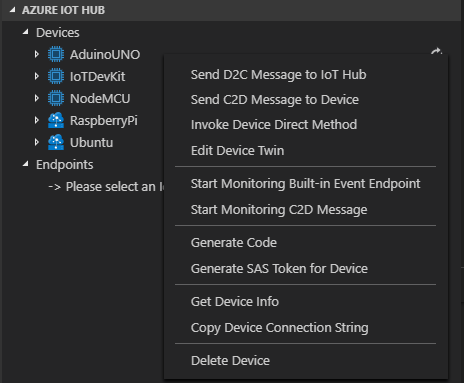
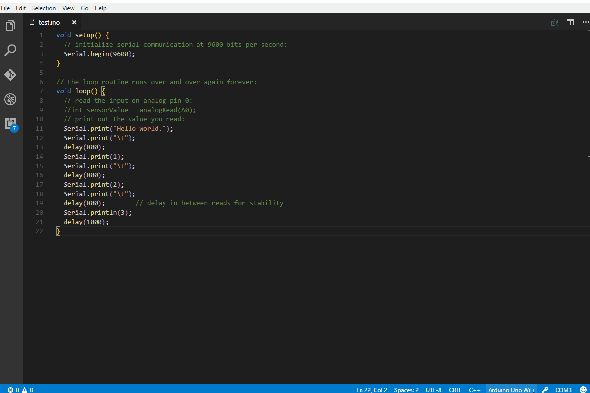
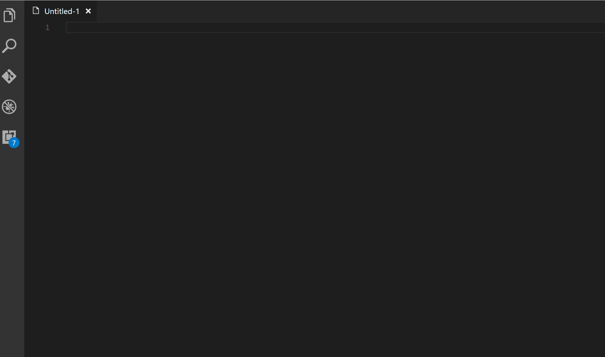
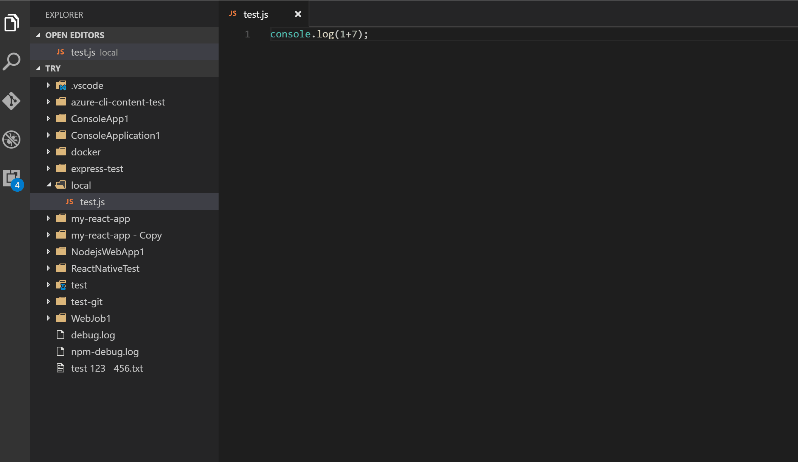

# Azure IoT Toolkit

[](https://gitter.im/formulahendry/vscode-azure-iot-toolkit?utm_source=badge&utm_medium=badge&utm_campaign=pr-badge&utm_content=badge) [](https://marketplace.visualstudio.com/items?itemName=formulahendry.azure-iot-toolkit) [](https://marketplace.visualstudio.com/items?itemName=formulahendry.azure-iot-toolkit) [](https://marketplace.visualstudio.com/items?itemName=formulahendry.azure-iot-toolkit) [](https://travis-ci.org/formulahendry/vscode-azure-iot-toolkit) [](https://ci.appveyor.com/project/formulahendry/vscode-azure-iot-toolkit)

Toolkit makes Azure IoT Development easier. For more awesome Azure IoT projects and resources, please visit https://aka.ms/azure.iot

## Features

[x] Device Explorer

[x] Send messages to Azure IoT Hub (device-to-cloud message)

[x] Monitor device-to-cloud messages

[x] Code snippet for IoT Hub

[x] Send messages to Azure Event Hub

[x] Monitor Event Hub messages

[x] Send/monitor messages from Azure IoT Hub to device (cloud-to-device message)

[x] Device management (List, Create, Delete)

[x] Discover devices connected via Ethernet, USB serial and WiFi

[x] Deploy and run in remote machine

[ ] Debug in remote machines

[ ] And more...

## Device Explorer

* Device management
    * List devices
    * Get device info
    * Create device
    * Delete device
* Interact with Azure IoT Hub
    * Send D2C message to IoT Hub
    * Monitor IoT Hub D2C message

### Prerequisites

1. In Explorer of VS Code, click "IoT Hub Devices" in the bottom left corner.


2. If you have not set Iot Hub Connection String before, an input box will pop up, then enter your Iot Hub Connection String (It is one-time configuration).


3. The device list will be shown.



## Commands

| Command | Keyboard Shortcuts | Menu Contexts |
| --- | --- | --- |
| IoT: Send message to IoT Hub | Ctrl+Alt+F9 | editor/context |
| IoT: Start monitoring IoT Hub message | Ctrl+Alt+F10 | editor/context |
| IoT: Stop monitoring IoT Hub message | Ctrl+Alt+F11 | editor/context (in output panel) |
| IoT: Send C2D message to device | None | None |
| IoT: Start monitoring C2D message | None | None |
| IoT: Stop monitoring C2D message | None | editor/context (in output panel) |
| IoT: Send message to Event Hub | None | editor/context |
| IoT: Start monitoring Event Hub message | None | editor/context |
| IoT: Stop monitoring Event Hub message | None | editor/context (in output panel) |
| IoT: List device | Ctrl+Alt+F1 | editor/context |
| IoT: Create device | Ctrl+Alt+F2 | editor/context |
| IoT: Delete device | Ctrl+Alt+F3 | editor/context |
| IoT: Discover connected device | Ctrl+Alt+F6 | editor/context |
| IoT: Deploy to remote machine | Ctrl+Alt+F4 | None |
| IoT: Run in remote machine | Ctrl+Alt+F5 | None |

## Usages

* Send messages to Azure IoT Hub


* Monitor device-to-cloud messages


* Code Snippets

| Trigger | Content |
| ---- | ---- |
| iotSendD2CMessage | Send D2C message to IoT Hub |
| iotMonitorD2CMessage | Monitor D2C message for IoT Hub |
| iotSendC2DMessage | Send C2D message to device |
| iotMonitorC2DMessage | Monitor C2D message from IoT Hub |
| iotCallDirectMethods | Send direct methods to device |
| iotReceiveDirectMethods | Receive direct methods from IoT Hub |


> After code snippet is created, you need to install corresponding npm package (e.g. [azure-iot-device-mqtt](https://www.npmjs.com/package/azure-iot-device-mqtt)) to run the code snippet.
> If you want to 'Run Code' directly, you need to install [Code Runner](https://marketplace.visualstudio.com/items?itemName=formulahendry.code-runner).

* Send/monitor C2D messages for Azure IoT Hub




* Send/monitor messages for Azure Event Hub



* Device management (List, Create, Delete)


* Deploy and run in remote machine

| Config | description |
| ---- | ---- |
| azure-iot-toolkit.localFolder | The folder of current machine to deploy |
| azure-iot-toolkit.remoteFolder | The folder of remote machine to deploy |
| azure-iot-toolkit.host | The hostname or IP address of remote machine |
| azure-iot-toolkit.username | The username of remote machine |
| azure-iot-toolkit.password | The password of remote machine |
| azure-iot-toolkit.command | The command to run in remote machine |



* Discover Ethernet, USB serial, WiFi devices
  1. Install Node.js or install [device-discovery-cli](https://github.com/Azure/device-discovery-cli):

    ```
    $ npm install --global device-discovery-cli
    ```
  2. Discover devices in VS Code:


## Configuration

To set the Device Connection String which is used to send device-to-cloud message or other functions as a device simulator:
```json
{
    "azure-iot-toolkit.deviceConnectionString": "HostName=<my-hub>.azure-devices.net;DeviceId=<known-device-id>;SharedAccessKey=<known-device-key>"
}
```

To set the IoT Hub Connection String to monitor device-to-cloud message or other functions as a service simulator:
```json
{
    "azure-iot-toolkit.iotHubConnectionString": "HostName=<my-hub>.azure-devices.net;SharedAccessKeyName=<my-policy>;SharedAccessKey=<my-policy-key>"
}
```

To set the IoT Hub Consumer Group (default is "$Default"):
```json
{
    "azure-iot-toolkit.iotHubConsumerGroup": "$Default"
}
```

To set the Event Hub Connection String:
```json
{
    "azure-iot-toolkit.eventHubConnectionString": "{Event Hubs connection string}"
}
```

To set the Event Hub Path:
```json
{
    "azure-iot-toolkit.eventHubPath": "{Event Hub path/name}"
}
```

To set the Event Hub Consumer Group (default is "$Default"):
```json
{
    "azure-iot-toolkit.eventHubConsumerGroup": "$Default"
}
```

To set whether to show verbose info when monitoring messages (default is `true`):
```json
{
    "azure-iot-toolkit.showVerboseMessage": true
}
```

## Telemetry data
By default, anonymous telemetry data collection is turned on to understand user behavior to improve this extension. To disable it, update the settings.json as below:
```json
{
    "azure-iot-toolkit.enableAppInsights": false
}
```

## Change Log
See Change Log [here](CHANGELOG.md)

## Issues
Submit the [issues](https://github.com/formulahendry/vscode-azure-iot-toolkit/issues) if you find any bug or have any suggestion.

## Contribution
Fork the [repo](https://github.com/formulahendry/vscode-azure-iot-toolkit) and submit pull requests.